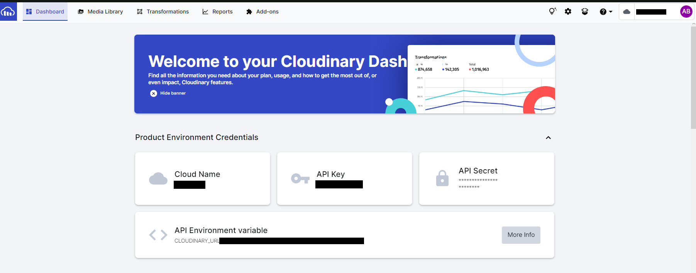

# Compendi

## Table of Contents
-- [Compendi](#compendi)
  - [Table of Contents](#table-of-contents)
  - [Overview](#overview)
    - [Features](#features)
      - [Possible Future Features:](#possible-future-features)
    - [Demo Video](#demo-video)
  - [Central Tech Stack](#central-tech-stack)
  - [Setting up:](#setting-up)

 

---
## Overview
Compendi is aimed at authors and writers looking for a place to organize and store their notes which is accessible from any device. 
With Compendi users can create project files with unlimited nested folders and files within them and they can find and store images in a multitude of ways.

### Features
 - Project folders 
 - Unlimited nesting of folders within projects
 - File addition on any level of a project
 - Image linking within files
 - Profile management

#### Possible Future Features:
 - Project and profile statistic tracking system
 - Ability to reorder file, folders and sections
 - Ability to export/print project sections and whole projects

### Demo Video

 

--- 
## Central Tech Stack
- Python
- Flask
- Flask-SQLAlchemy
- HTML
- Jinja
- CSS
- Cloudinary API
- Werkzeug
  
 

---
## Project Organization:

    📦Compendi
    ┣ 📂data
    ┃ ┣ 📜files.json
    ┃ ┣ 📜folders.json
    ┃ ┗ 📜projects.json
    ┣ 📂env...
    ┣ 📂static
    ┃ ┣ 📜Compendi_logo.svg
    ┃ ┣ 📜file.svg
    ┃ ┣ 📜folder.svg
    ┃ ┣ 📜gear.svg
    ┃ ┣ 📜person.svg
    ┃ ┣ 📜plus.svg
    ┃ ┣ 📜reset.css
    ┃ ┗ 📜styles.css
    ┣ 📂templates
    ┃ ┣ 📜base.html
    ┃ ┣ 📜file_view.html
    ┃ ┣ 📜folder_view.html
    ┃ ┣ 📜homepage.html
    ┃ ┣ 📜login.html
    ┃ ┣ 📜profile.html
    ┃ ┣ 📜projects.html
    ┃ ┗ 📜register.html
    ┣ 📜.gitignore
    ┣ 📜config.sh
    ┣ 📜crud.py
    ┣ 📜forms.py
    ┣ 📜model.py
    ┣ 📜requirements.txt
    ┣ 📜seed_database.py
    ┗ 📜server.py

 

---
## Setting up:
1. Clone the repo. If you need some help with cloning go ahead and take a look at [Githubs documentation](https://docs.github.com/en/repositories/creating-and-managing-repositories/cloning-a-repository). 

2.  Get your virtual enviornment set up. This step can very depending on prefrences.
    *  [Here](https://www.freecodecamp.org/news/how-to-setup-virtual-environments-in-python/) is a great source to which covers a few options as well as explains virtual enviornemnts if you need it.
    *  It's important to note that this process cna look different depending on your OS. So be ready to do a few goodle searches if my process doesn't work out for you.
    * *My method with Virtualenv, so if you follow it make sure you have Virtualenv installed!*
    * Steps:
  
        1. Navigate to **'Compendi'** folder within the overall repo project, open up bash and input: 

            `python -m venv ./env`
                    
            *Or*
            
            `python<version> -m venv <virtual-environment-name>`

        2. To activate your virtual enviornment use the *source* command on the activate file in /venv/Scripts/

            `source ./venv/Scripts/activate`
            
            *!this command will need to be run everytime you open the terminal!*

        3. Finally you just need to pip install the packages from the requierments file

            `pip install -r requirements.txt `

 

3. that you have your virtual enviornment set up and have all the packages installed you just need to set up your *config.sh*

   1. Within the 'Compendi' folder create a file called *config.sh*

        `touch config.sh`

    2. Within this file there are some enviornment variables we need to set up.
   
        *!This step assumes you already have Postgres set up on your system!*

        **Ultimatly**, you should have a file that looks like this:

            export POSTGRES_URI="[YOUR POSTGRES_URI]"
            export SECRET_KEY="[YOUR SECRET KEY]"

            export CLOUDINARY_URL='[YOUR CLOUDINARY_URL]'
            export CLOUDNAME='[YOUR CLOUDNAME ]'
            export CLOUDAPIKEY='[YOUR CLOUDAPIKEY]'
            export APISECRET='[YOUR APISECRET]'

        For your **POSTGRES_URI**, if you need some help, take a look at the [official documentation](https://www.postgresql.org/docs/current/libpq-connect.html#LIBPQ-CONNSTRING) 

        In general it should follow this format:

            postgresql://<user>:<password>@localhost:<port>/<dbname>

        For **port**, I always use port 5432, and for the this project I think a simple **database** name is good so somthing like CompendiDB or whatever you want will work.

    3. For the the last four variables, you will need to set up a [cloudinary account](https://cloudinary.com/users/register_free#gsc.tab=0), but don't worry its free for up to start out.
        1. Navigate to the link above and go ahead and sign up like you would any other site
        2.  once you have your account, login and navigate to your dashboard. 

Should look something like this:

*This is where you will find all the info you need to fill in the rest of your config.sh file.*

1. Once you have your config.sh file set up go ahead and run it in the terminal to get your enviornment variables exported.
   
    `source config.sh`
    
2. Now that all of that is set up go ahead and run *server.py*, `python server.py`, and navigate to the locally hosted [Compendi site](http://localhost:5000)!
    * You can run `python seedatabase.py` to seed the database if you would like, but it's not needed. Feel free to register an account and take a look around!
   
